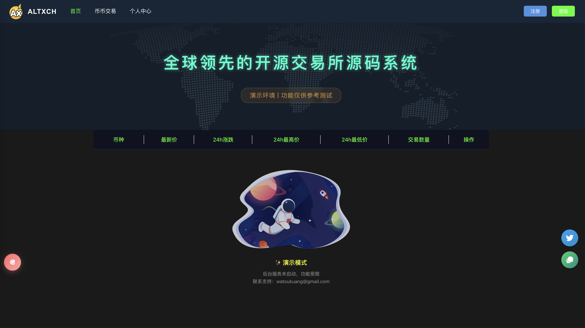
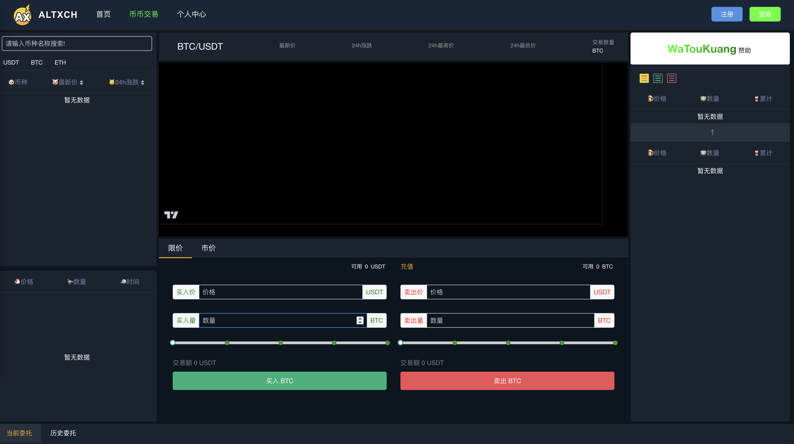
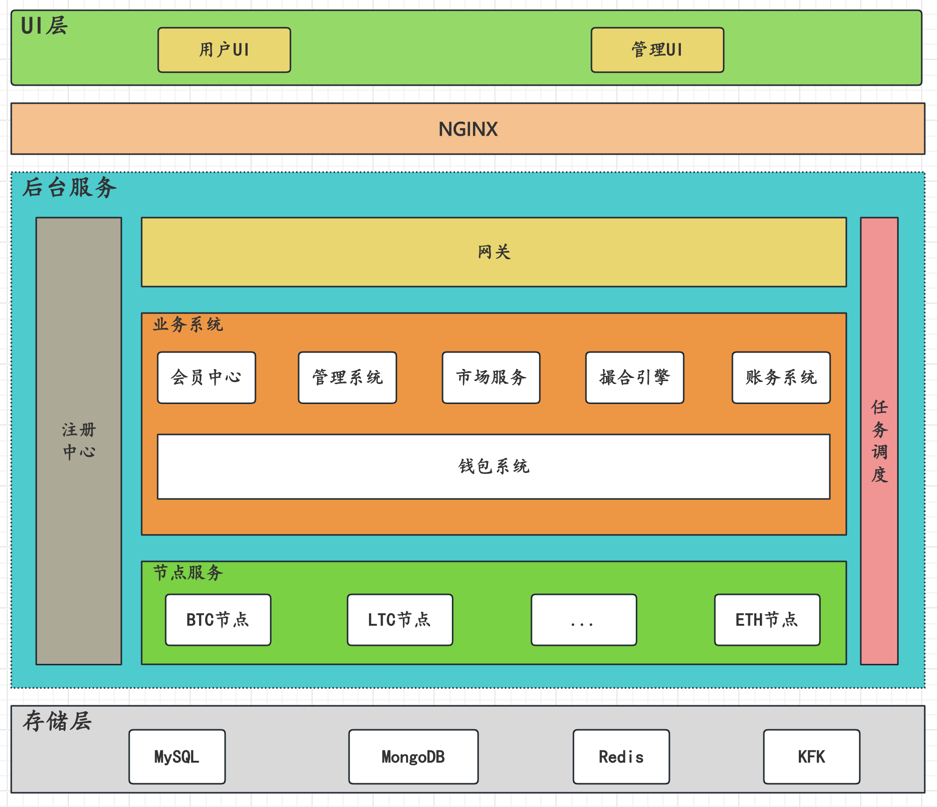
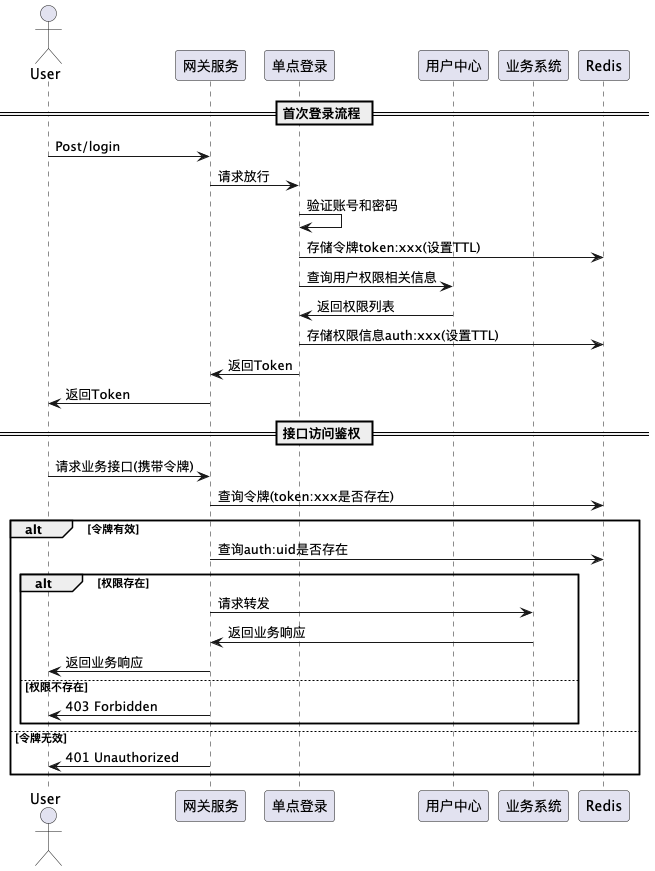

# 📌 ALTXCH 数字资产交易平台

  

## 🔥 项目描述
 
**ALTXCH**是一款基于**SpringCloud**微服务架构的开源数字货币交易所**解决方案**，专为**小型交易所**快速部署和**开发者学习交易所核心业务**而设计。 系统采用前后端解耦的现代化架构设计，
基于分布式微服务体系构建。 前端基于Vue3和TypeScript构建响应式界面, 后端依托SpringBoot和MyBatisPlus实现业务逻辑处理。 通过**Redis**实现毫秒级的高频数据缓存，**MySQL**确保核心业
务数据的强一致性，**Kafka**构建高可靠的消息队列，**MongoDB**处理海量业务数据，形成完整的技术闭环。
- 网关服务: 作为系统的统一入口，基于Gateway构建的高性能网关，提供动态路由、流量控制、接口鉴权等核心能力，确保系统的安全性和稳定性。
- 注册中心: 采用Eureka构建的分布式服务注册发现中心，实现微服务的自动注册与健康检查。通过心跳检测机制实时监控服务状态变化，结合邮件告警机制，确保服务网格的稳定运行。
- 管理系统: 基于RBAC模型构建的综合管理平台，包含用户管理、菜单管理、权限管理、内容管理、币币管理、财务管理等功能，为运营人员提供全流程可视化管控能力。
- 会员系统: 主要处理会员相关的操作，提供会员登录、注册、信息修改、现货管理、交易记录查询等功能。
- 市场服务: 作为交易系统的核心枢纽，采用高效的事件驱动架构实时处理订单的创建、撤单等操作。通过KFK与撮合系统高效协同，动态维护盘口数据，深度图表和实时成交记录，基于WebSocket实时毫秒级市场数据推送。
- 撮合服务: 采用高性能内存撮合引擎，通过价格优先、时间优先规则匹配买卖订单，实时生成成交记录并更新订单簿深度，支持限价/市价等多种订单类型，通过原子化操作确保交易一致性。
- 钱包服务: 提供安全的数字资产管理功能，集成多币种地址生成、充提币审核、余额变动通知等核心模块，采用冷热钱包分离架构和多重签名机制保障资产安全。
- 节点服务: 实现与主流公链（BTC/ETH 等）的深度交互，提供区块链高度同步、交易广播、智能合约调用等底层支持。
- 任务模块: 基于 XXL-JOB 构建分布式任务调度平台，精准执行定时区块同步、深度图生成等批处理任务，确保关键业务按时触发。

**演示地址**
前端:https://altxch.com  

备注:服务成本原因，只部署了前端

---
## 🐈 项目截图
### 首页截图

### 撮合引擎截图

## 🚀 系统架构

  

## 🍀 核心流程

### 鉴权认证

  

### 创建订单

### 订单撮合

### 钱包充值

### 钱包提现

### 创建钱包

---

## 🛠️ 运行流程
- 启动注册中心:altxch-cloud
- 启动网关服务:altxch-gateway
- 启动撮合引擎:altxch-match
- 启动市场服务:altxch-exchange
- 启动用户中心:altxch-ucenter
- 启动管理系统:altxch-admin
- 启动钱包服务:altxch-wallet
- 启动节点服务:altxch-nodes

## ⚠️ 免责声明与使用条款

### 🔒 重要声明

1. **📜 代码用途限制**
    - 🚫 本项目开源代码**仅供学习参考和技术研究**，禁止用于任何非法用途
    - ⛔ 严禁将本代码用于未经授权的商业运营或非法金融活动

2. **⚖️ 法律合规要求**
    - ✅ 如需基于本代码搭建运营交易所，**必须**：
        - 📑 遵守所在国家/地区的金融监管法律法规
        - 🏛️ 取得必要的金融业务许可和资质
        - 🕵️ 实施完整的KYC/AML合规流程

3. **🛡️ 责任免除**
    - ❌ 开发者/代码贡献者**不承担**因以下情况导致的任何法律责任：
        - ⚠️ 代码被用于非法用途
        - ⚠️ 未取得合法资质擅自运营
        - ⚠️ 违反当地金融监管规定

4. **👤 使用者义务**
    - 🤝 使用本代码即表示您已充分理解并同意：
        - ⚠️ 自行承担所有使用风险
        - ✅ 确保使用方式完全合法合规
        - 🚨 如发现非法使用，有义务立即停止并举报

### 💡 合规提示

我们强烈建议：  
🔹 ✅ 在使用前咨询专业法律顾问  
🔹 📚 完整了解所在司法管辖区的数字货币监管政策  
🔹 🔍 仅将代码用于合法授权的技术研究

*❗ 注：任何违反上述条款的行为均与代码作者及贡献者无关，使用者需自行承担全部法律责任。*

---

## 🤝 贡献指南

欢迎提交 Pull Request。对于重大变更，请先开 Issue 讨论。

1. 🍴 Fork 项目
2. 🌿 创建特性分支 (`git checkout -b feature/AmazingFeature`)
3. 💾 提交更改 (`git commit -m 'Add some AmazingFeature'`)
4. 🚀 推送到分支 (`git push origin feature/AmazingFeature`)
5. 🔄 开启 Pull Request

---

## 📜 许可证

[MIT](https://choosealicense.com/licenses/mit/)

---

## 📞 联系方式

- 🌐 官网: [https://altxch.com](https://altxch.com)
- ✉️ 邮箱: watoukuang@gmail.com
- 🐦 Twitter: [@altxch](https://x.com/watoukuang)

---

💖 *感谢您的关注与支持！* 💖